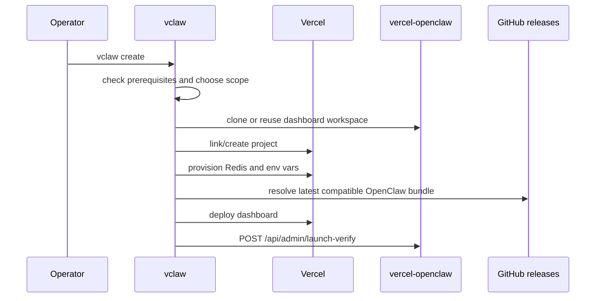
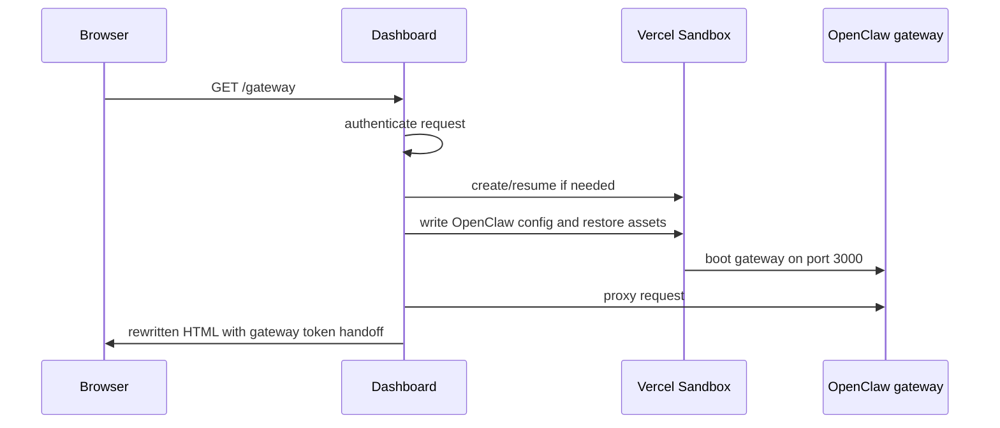
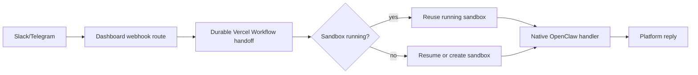

# Operational Paths

These are the end-to-end flows a maintainer should understand before changing setup, lifecycle, proxy, or channel behavior.

## Create And Deploy

The supported install path is `vclaw create` because it owns the full chain: local prereqs, Vercel project setup, Redis, env vars, deployment protection, deploy, launch verification, and optional channel connection.

Key sources live in the `vclaw` repository: `src/commands/create.mjs`, `src/steps/bundle.mjs`, `src/steps/env.mjs`, `src/steps/deploy.mjs`, and `src/steps/run-verify.mjs`.

## Production Debugging From A Linked Workspace

The best default for production debugging is a `vclaw create --auto-link --dir <local vercel-openclaw checkout>` run against the deployment you are investigating. `--auto-link` writes `.vercel/project.json` plus a local `.env.local` containing `ADMIN_SECRET`, `VERCEL_AUTOMATION_BYPASS_SECRET`, `VCLAW_PROJECT_SCOPE`, and `VCLAW_PROJECT_NAME`. From that directory, `vercel`, `vclaw`, admin curl scripts, and source inspection all target the same project.

Keep `.env.local` local and untracked. It is intentionally covered by `.gitignore`, along with `.vercel` and `.agent-runs/`. Save sanitized evidence under `.agent-runs/...`, but never copy admin secrets, bypass secrets, bot tokens, webhook secrets, or platform access tokens into artifacts or handoffs.

Use `LOCAL_READ_ONLY=1` in `.env.local` when running `pnpm dev` only to inspect production metadata. Remove it only for an intentional mutation test, because local admin routes still use the real production sandbox controller outside `NODE_ENV=test`.

## Sandbox Boot And Proxy

The dashboard authenticates before proxying HTML, manages the sandbox lifecycle, writes OpenClaw config, and rewrites proxied HTML for WebSocket routing plus gateway-token handoff. See [Sandbox Lifecycle and Restore](../lifecycle-and-restore.md), [Architecture](../architecture.md), and [Deployment Protection](../deployment-protection.md) for the deeper model.

## Channel Delivery

Channel incidents are layered. Separate these states in reports and code: OAuth/config complete, credentials saved, config sync applied, handler registered, route ready, native forward accepted, and user-visible reply.

Both running and stopped sandboxes use the durable Workflow handoff. The Workflow reuses an already-running sandbox or resumes or creates one, waits for the native handler to be ready, and then forwards the original platform payload. Do not treat this path as a generic chat-completions fallback when debugging delivery.

For stuck delivery, start from live evidence: `GET /api/admin/why-not-ready`, `GET /api/channels/summary`, `GET /api/admin/sandbox-diag`, and `GET /api/admin/logs`. Use [Channels and Webhooks](../channels-and-webhooks.md) and the channel-debug instructions in `CLAUDE.md`/`AGENTS.md` before proposing fixes.

## Verification Boundaries

- A deployed dashboard URL does not prove the sandbox can boot or complete chat.
- Preflight passing does not prove channel-ready delivery.
- Destructive launch verification proves runtime channel readiness, not external platform delivery. A real Slack or Telegram test message is still required after channel setup. Hosted Discord is unsupported and has no delivery test path.
- `lastForward.ok:true` proves native acceptance, not necessarily a human-visible reply.
- Passing CI does not prove a protected deployment can receive external webhooks.
